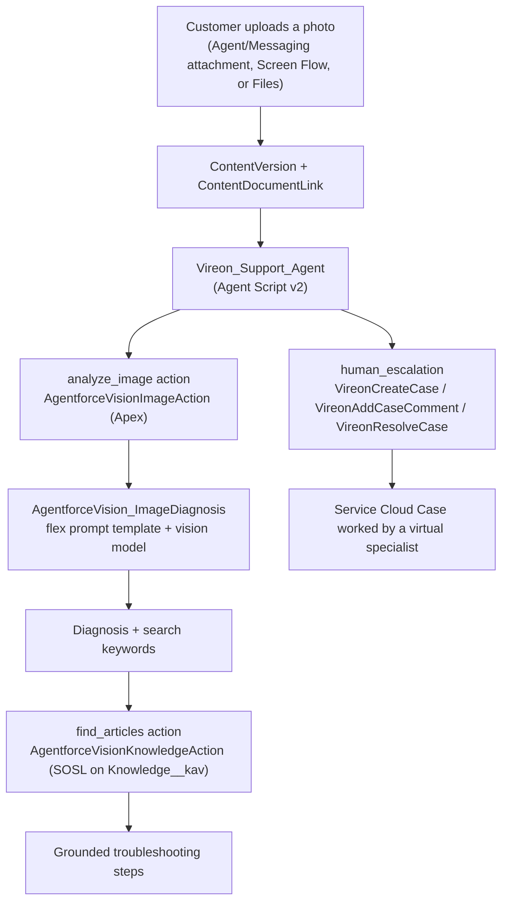

# Agentforce Vision

**Let an Agentforce agent look at a customer's photo, diagnose the problem, and walk them through the fix - entirely on the Salesforce platform.**

Agentforce Vision is a Salesforce-only reference solution. A customer uploads a photo of a device or an error screen (a blinking router light, a `VS-1004` streaming error, a thermostat fault code), and the agent:

1. Analyzes the image with a vision-capable model via a GenAI prompt template.
2. Grounds a fix in your Lightning Knowledge base (no hallucinated steps).
3. Escalates to a "virtual" specialist in Service Cloud when a human is needed - creating and working a Case with comments, no live agent required.

It ships with the Apex actions, the vision prompt template, the Agent Script agent, a permission set, the Knowledge field, sample articles, and a one-command installer.

> This repository contains **only the Salesforce platform files**. It does not include any website/front-end - the image-analysis capability runs 100% on-platform (see [How it works](#how-it-works)).

---

## Disclaimers and prerequisites

> [!IMPORTANT]
> **This installer deploys metadata into an org you already have. It does NOT - and cannot - turn on org features for you.** Confirm the following before you install. If a prerequisite is missing, `install.sh` stops with guidance instead of a cryptic deploy error.

You must have, in the target org:

- **Agentforce enabled**, with an **Agentforce (Einstein) Service Agent** license and a provisioned agent user (Profile = `Einstein Agent User`). The installer auto-detects this user; you can also enter it when prompted.
- **Einstein generative AI / Prompt Builder** enabled, with access to a **vision-capable model**. The template targets `sfdc_ai__DefaultGPT55`; model names and availability vary by org, edition, and region - you may need to point the template at a different vision model in Prompt Builder.
- **Lightning Knowledge enabled** (required for the `Knowledge__kav` object and the `FAQ_Answer__c` field to deploy), plus a **Knowledge-enabled user** to publish articles.
- **Einstein / Trust Layer terms accepted** and any required data spaces configured, where applicable.
- **Salesforce CLI (`sf`) v2** installed and authenticated to the org, as a user with API access and permission to deploy metadata (customize application / modify metadata).
- To let customers actually chat with the agent, a **connection channel** (Enhanced Messaging / Messaging for Web, or the Agent API) configured **separately** - this package deploys the agent, not a channel.

Additional notes:

- The demo company ("Vireon") and all sample articles/images are **fictional**.
- This is a community reference sample provided **as-is** under the [MIT License](LICENSE). It is **not an official Salesforce product** and is not supported by Salesforce.
- Running the agent and vision model consumes **Einstein generative AI usage** and is subject to your org's limits and entitlements.

---

## How it works

The image never leaves Salesforce. A photo uploaded through any standard channel becomes a `ContentVersion`; the agent's `analyze_image` action passes that file to a **flex prompt template** bound to a vision model, then grounds the answer in Knowledge.



Why a prompt template (and not a direct Models API call)? The Models API does not accept images; a **flex prompt template bound to a `ContentDocument` input** is the supported path for multimodal analysis. `AgentforceVisionImageAction` orchestrates that call with `ConnectApi.EinsteinLLM.generateMessagesForPromptTemplate`.

How the photo gets in, on-platform:
- **Agent / Enhanced Messaging chat**: the customer attaches a photo in the conversation.
- **Screen Flow**: a File Upload component on a Case or record.
- **Files**: any image uploaded to a related record.

`AgentforceVisionImageAction` resolves the image in priority order: an explicit `ContentDocument` id, the most recent image linked to the conversation/record, then the most recent image uploaded in the last 10 minutes (the just-sent photo).

---

## What gets installed

| Component | API name | Purpose |
| --- | --- | --- |
| Apex | `AgentforceVisionImageAction` | Analyze the uploaded image via the vision prompt template |
| Apex | `AgentforceVisionKnowledgeAction` | SOSL search Knowledge and return grounded article content |
| Apex | `VireonCreateCase` / `VireonAddCaseComment` / `VireonResolveCase` | Virtual-human escalation: create, comment on, and resolve a Service Cloud Case |
| Prompt template | `AgentforceVision_ImageDiagnosis` | Flex template bound to a `ContentDocument`, running a vision model |
| Agent (Agent Script) | `Vireon_Support_Agent` | Routes to photo troubleshooting, Knowledge FAQ, and human escalation |
| Permission set | `Agentforce_Vision` | Grants access to the Apex actions, Knowledge read, and Case CRUD |
| Custom field | `Knowledge__kav.FAQ_Answer__c` | Rich-text article body the Knowledge action reads |
| Apex script | `scripts/apex/create_vireon_knowledge.apex` | Seeds and publishes 9 sample troubleshooting articles |
| Sample images | `demo-assets/vision-samples/*.png` | Nine photos matching the nine sample articles, for testing |

The agent's compiled planner bundle and bot are intentionally **not** included; `sf agent publish` regenerates them in your org from the Agent Script source.

---

## Install

### Option A - one command (from GitHub)

```bash
/bin/bash -c "$(curl -fsSL https://raw.githubusercontent.com/sfdc-brendan/AgentforceVision/main/install.sh)" -- -o <your-org-alias>
```

### Option B - clone and run

```bash
git clone https://github.com/sfdc-brendan/AgentforceVision.git
cd AgentforceVision
./install.sh -o <your-org-alias>
```

If you omit `-o`, the installer uses your `sf` default org. Useful flags: `--skip-knowledge` (don't seed articles), `--skip-agent` (deploy metadata only). Run `./install.sh -h` for all options.

The installer will: verify the `sf` CLI and org connection, confirm Lightning Knowledge is enabled, auto-detect (or prompt for) the Agentforce Service Agent user and bind the agent to it, deploy the metadata, assign the permission set, seed the Knowledge articles, then publish and activate the agent.

### Manual install

```bash
# 1. Detect your Agentforce Service Agent user (Profile = 'Einstein Agent User')
sf data query -o <org> -q "SELECT Username FROM User WHERE Profile.Name = 'Einstein Agent User' AND IsActive = true"

# 2. Edit the agent bundle and replace the placeholder with that username:
#    force-app/main/default/aiAuthoringBundles/Vireon_Support_Agent/Vireon_Support_Agent.agent
#    default_agent_user: "__AGENTFORCE_SERVICE_AGENT_USER__"  ->  your agent user

# 3. Deploy, assign, seed, publish, activate
sf project deploy start -d force-app -o <org>
sf org assign permset -n Agentforce_Vision -o <org>
sf apex run -f scripts/apex/create_vireon_knowledge.apex -o <org>
sf agent publish authoring-bundle -n Vireon_Support_Agent -o <org> --skip-retrieve
sf agent activate -n Vireon_Support_Agent -o <org>
```

---

## Test it

```bash
sf agent preview -n Vireon_Support_Agent -o <org> --use-live-actions
```

Upload one of the photos in `demo-assets/vision-samples/` (each maps to a sample article - e.g. `vireon-router-amber.png`, `vireon-thermostat-e5.png`, `vireon-stream-error-vs1004.png`) to a record or attach it in a chat, then ask the agent to take a look. You should get a plain-language diagnosis followed by grounded steps from the matching Knowledge article. Ask for "a human" to see the virtual-specialist Case escalation.

---

## Customize / rebrand

- **Company and content**: "Vireon" is fictional. Edit the system prompt and welcome message in `Vireon_Support_Agent.agent`, and replace the articles in `scripts/apex/create_vireon_knowledge.apex` with your own.
- **Knowledge shape**: the search reads `Knowledge__kav.FAQ_Answer__c`. If your Knowledge uses a different body field, update `AgentforceVisionKnowledgeAction` and the field metadata.
- **Model**: change the vision model in Prompt Builder on the `AgentforceVision_ImageDiagnosis` template if `sfdc_ai__DefaultGPT55` isn't available in your org.
- **Escalation**: the `Vireon*Case` classes assign a random "specialist" name and work the Case with comments; adjust the personas/logic to taste.

---

## Troubleshooting

- **Deploy fails on `Knowledge__kav` / `FAQ_Answer__c`**: Lightning Knowledge isn't enabled. Turn it on in Setup > Knowledge Settings and re-run.
- **`sf agent publish` fails**: confirm Agentforce and a Service Agent license are enabled, and that the agent user bound in the bundle exists and is active in this org.
- **"No image was found"**: the photo must be uploaded before analysis. In a live channel it's the chat attachment; when testing, upload the image first, then ask the agent within ~10 minutes.
- **Agent gives generic/wrong steps**: make sure the Knowledge articles were seeded and published (`--skip-knowledge` was not set), and that the running user can read `FAQ_Answer__c`.
- **Vision model errors**: the template may point at a model your org lacks. Change it in Prompt Builder.

---

## Repository structure

```
force-app/main/default/
  aiAuthoringBundles/Vireon_Support_Agent/   Agent Script source (the agent)
  classes/                                   Apex actions + tests
  genAiPromptTemplates/                      AgentforceVision_ImageDiagnosis
  objects/Knowledge__kav/fields/             FAQ_Answer__c
  permissionsets/                            Agentforce_Vision
scripts/apex/create_vireon_knowledge.apex    Sample Knowledge seeder
demo-assets/vision-samples/                  Nine sample photos for testing
install.sh                                   One-command installer
```

## License

[MIT](LICENSE). Fictional demo content. Not an official Salesforce product.
